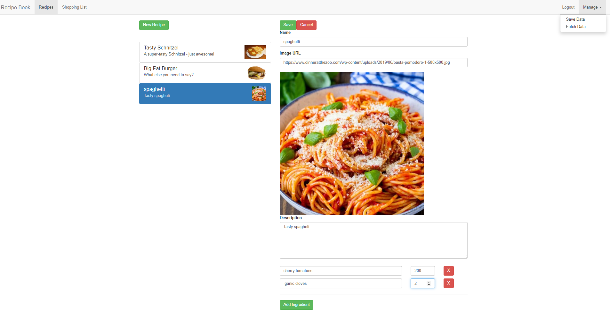

# Recipe book and Shoping list app in Angular 8

This app stores recipes and the necessary shopping list.

### Run the Application

Install all node_modules

```
npm install
```

Run on localhost:4200

```
ng serve
```

## Built With

* [Angular 8](https://angular.io/)
* [TypeScript](https://www.typescriptlang.org/)
* [Angular-cli](https://cli.angular.io/)
* [Bootstrap](http://getbootstrap.com/)

## Screenshot



---


